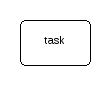
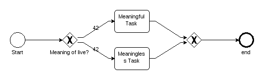
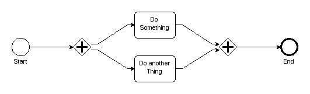

# Brainslug Flow Node Types

## Task Node

A Task Node will be executed for every incoming token and produces one token per outgoing edge. See the [task documentation](task)
for details on how to define what a task should do during execution.



## Event Node

An Event Node is triggered by every incoming token and produces one token per outgoing edge.
There are different type of event: Start Events, End Events, Wait (Intermediate) Events.

```java
new FlowBuilder() {
  @Override
  public void define() {
    flowId(id("event_flow"));

    start(event(id("start")).display("Every 5 Seconds"), every(5, TimeUnit.SECONDS))
      .waitFor(event(id("wait")).display("After 5 Seconds").elapsedTime(5, TimeUnit.SECONDS))
      .execute(task(id("doIt")).display("Do Something"))
      .end(event(id("end")).display("End"));
  }
};
```


Start Events mark the start of a flow and are generally the starting point of your flow definition.
The `waitFor`-method takes an event definition which might have duration to wait for and create a intermediate event
for it.

End Events mark the end of a flow execution path and are optional.

## Choice Node

A Choice Node will be executed for every incoming token. A token is produced for the first outgoing path
where the predicate is fullfilled.

```java
FlowBuilder flowBuilder = new FlowBuilder() {
 Integer meaningOfLife = 42;

 @Override
 public void define() {
   flowId(id("choice_flow"));

   start(event(id(StartEvent)).display("Start"))
     .choice(id(Choice)).display("Meaning of live?")
     .when(eq(constant(meaningOfLife), 42))
     .execute(task(id(SecondTask)).display("Meaningful Task"))
       .or()
     .when(eq(constant(meaningOfLife), 43))
     .execute(task(id(ThirdTask)).display("Meaningless Task"));

   merge(id(Merge), id(SecondTask), id(ThirdTask)).end(event(id(EndEvent2)).display("end"));
 }

};
```

## Merge Node

A Merge Node merges different execution paths. It will be executed for every incoming token. A token is produced for every outgoing edge.

# Example with Choice and Merge Nodes



## Parallel Node

A Parallel Node defines flow paths which are meant for parallel execution, if the execution is really concurrent depends on the
configuration of the corresponding `FlowNodeExecutor`. It will be executed for every incoming token. A token is produced for every outgoing edge.

```java
FlowBuilder flowBuilder = new FlowBuilder() {

  @Override
  public void define() {
    flowId(id("parallel_flow"));

    start(event(id(StartEvent)).display("Start"))
      .parallel(id(Parallel))
      .execute(task(id(SecondTask)).display("Do Something"))
      .and()
      .execute(task(id(ThirdTask)).display("Do another Thing"));

    join(id(Join), id(SecondTask), id(ThirdTask)).end(event(id(EndEvent2)).display("End"));
  }

};
```

## Join Node

A Parallel Node joins or synchronizes multiple concurrent execution paths. It will only be executed if it has tokens from every incoming edge.
A token is produced for every outgoing edge.

# Example with Parallel and Join Nodes




